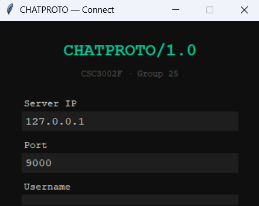
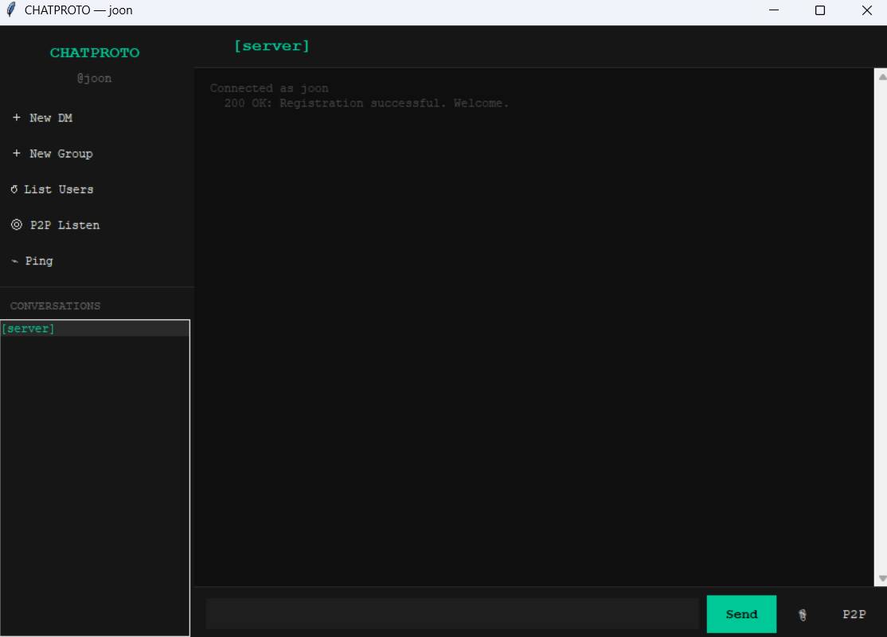

# Networked Chat Application

A desktop chat application built in Python as a three-person University of Cape Town group project.

The project demonstrates socket programming, client-server communication, multithreading, and desktop GUI development.

## Contributors

This project was developed as a three-person group project at the University of Cape Town.

- Joonho Park
- Jordan Rix
- Dennis Zhu

## Screenshots

### Connect Screen


### Main Chat Window


## Features

- Username registration and online user discovery
- Direct messaging
- Group messaging
- File and media transfer
- Peer-to-peer file transfer
- TCP and UDP socket communication
- Custom application-layer messaging protocol
- Multithreaded networking
- Tkinter graphical interface

## Architecture

The application uses a client-server architecture.

- `server.py` — central server for connected users and message routing
- `client.py` — client-side networking and communication logic
- `GUI.py` — Tkinter graphical interface
- `main.py` — launcher that starts the local server and opens the GUI

## Running the Application

### Requirements

- Python 3
- Tkinter

The project uses only Python standard-library modules, so no additional `pip` packages are required.

### Start the application

```bash
python main.py
```

The launcher starts the local server and then opens the graphical client.

## Technologies

- Python
- TCP/UDP sockets
- Multithreading
- Tkinter
- Custom network protocol

## Project Context

This application was developed as a three-person group project at the University of Cape Town.

This repository is presented as portfolio work and does not imply individual authorship of every component.
